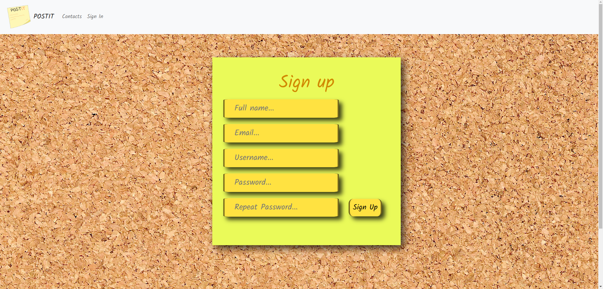
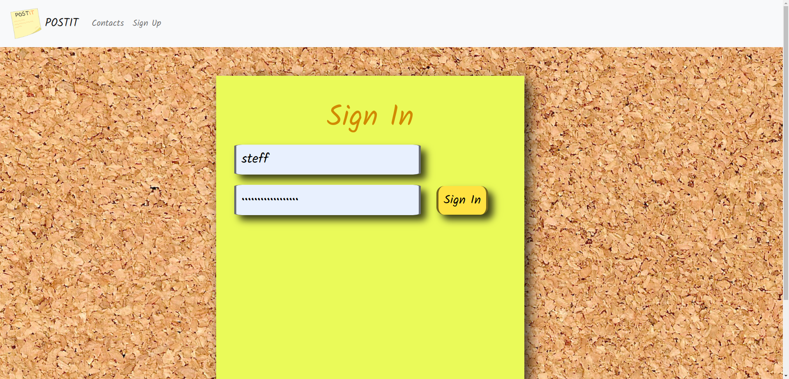
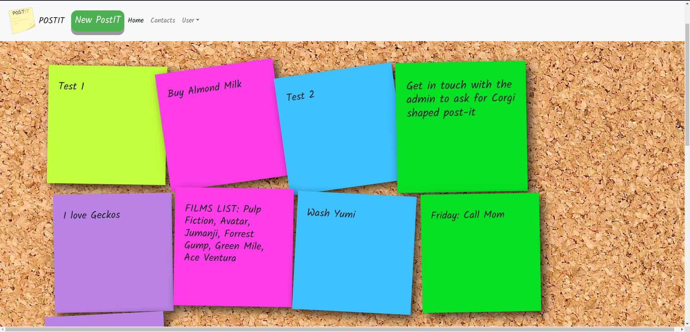
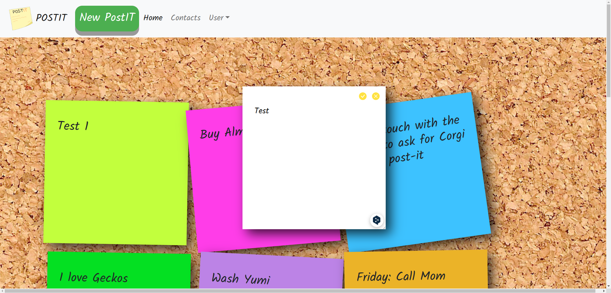

# POSTIT - A Complete Website for a Digital Corkboard 📒

## Overview 📝
**POSTIT** is a digital corkboard where you can attach colorful post-it notes. 
Designed for taking short notes, each post-it has a maximum character limit of 100. 
Users can create their own profiles, and their information along with the associated post-its will be stored in a database. 
Each profile and post-it will have a unique identifier.

## Features 💡
- **User Registration and Profile Creation:** Users can register on the platform and create their profiles, allowing them to personalize their experience.

- **Database Communication via SQL Queries:** The project utilizes SQL queries to interact with the database, ensuring efficient data management and retrieval.

- **Asynchronous Communication with AJAX:** AJAX functions are employed for asynchronous communication with the server, enhancing the user experience and responsiveness of the application.

- **Security:** To ensure database security, the project incorporates various security measures. These include the use of prepared statements and proper input validation in user-editable fields. Additionally, the project prioritizes the use of POST methodology over GET when appropriate for enhanced security.

## Some Pictures 📷

## Contact 📇

For questions or support, please feel free to contact me at gb8gb8**AT**gmail**DOT**com 

Feel free to explore the project, contribute, and adapt it to suit your data logging needs. Happy coding!
